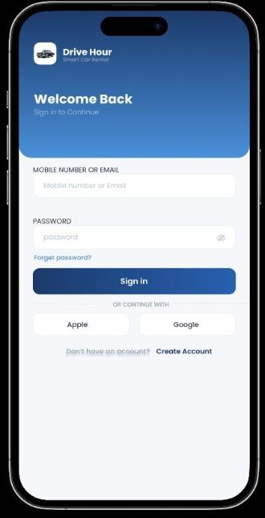
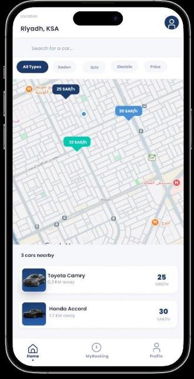
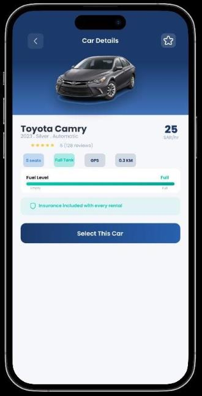
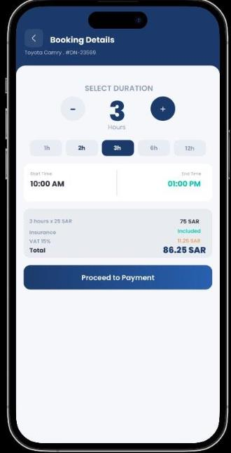
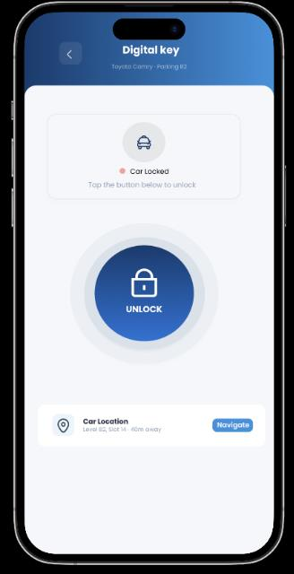
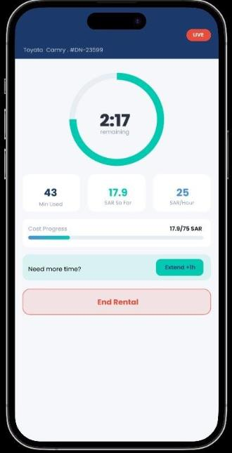
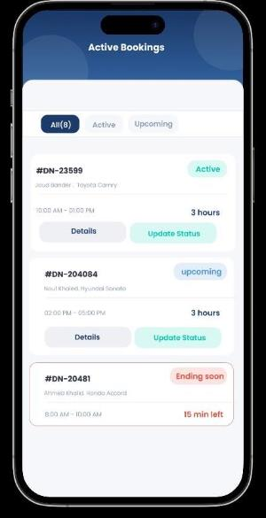
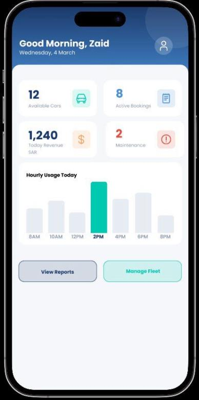

# Drive Hour — Smart Hourly Car Rental

A high-fidelity Figma prototype for an on-demand, hourly car rental app.

Built as a 5-person team project for a university Human-Computer Interaction course (CS351). I contributed across the whole project, working alongside four teammates.

**[View the interactive Customer prototype →](https://www.figma.com/proto/lkfQyWQSHPId8Yt8A9t19T/HCI-Project---Phase-2?page-id=0%3A1&node-id=1-2&starting-point-node-id=92%3A95)**

## Overview

Traditional car rental in Saudi Arabia is built around daily or long-term pricing, which is a poor fit for someone who just needs a car for a couple of hours — a quick errand, a same-day appointment, a short trip across town. Drive Hour is a smart hourly rental concept designed around that gap: real-time booking, live vehicle availability, and a digital key to unlock the car, all scoped to short rental windows instead of full days.

The design targets three types of users: **customers** renting cars, **employees** handling bookings and vehicle condition, and **supervisors** overseeing the fleet and operations.

## Design process

The prototype is based on user research from an earlier project phase — interviews and questionnaires that pointed to a real demand for flexible, short-term rental in Saudi Arabia. That research shaped the three-interface structure and the priority on minimal steps per task.

22 screens total, split across:

- **Customer interface** — 16 screens, covering the full journey from signup through active rental
- **Employee interface** — 3 screens, for managing bookings and vehicle inspections
- **Supervisor interface** — 3 screens, for fleet-wide operations and reporting

## Screens

**Customer**

**Employee**

**Supervisor**

## Usability testing & AI evaluation

The design was evaluated two ways: a usability test with 5 real participants, and an independent review using an AI evaluation tool (UX Pilot), compared side by side.

**Usability test results**

| | Result |
|---|---|
| Participants | 5 |
| Overall task success rate | 78% (39/50 tasks) |
| Average time per task | 1.9 min |
| Verdict | Usable — above the 70% threshold |

The recurring friction points: locating a nearby car on the map, understanding the booking-duration steps, and figuring out the Digital Key feature without prior guidance.

**AI evaluation (UX Pilot)**

The independent review agreed on the strengths — a consistent blue/white visual identity and a logical booking flow — and flagged issues our own evaluation had missed, including low contrast on the map markers and dense, small text on the Booking Details and Live Dashboard screens.

Running both evaluations side by side gave a fuller picture than either one alone would have.

## Future improvements

- Improve contrast and legibility of the map markers on the Home Map screen
- Simplify the Booking Details screen — reduce text density
- Add a short onboarding flow explaining the Digital Key feature to first-time users
- Extend the Supervisor interface with demand-prediction tools for peak hours

## Tools

Figma (design + interactive prototyping), UX Pilot (AI-assisted usability evaluation).

## Author

Joud Al Thonayan
Computer Science student, Princess Nourah University
[LinkedIn](https://www.linkedin.com/in/joud-al-thonayan-bb126a431) • [GitHub](https://github.com/JoudBander)
